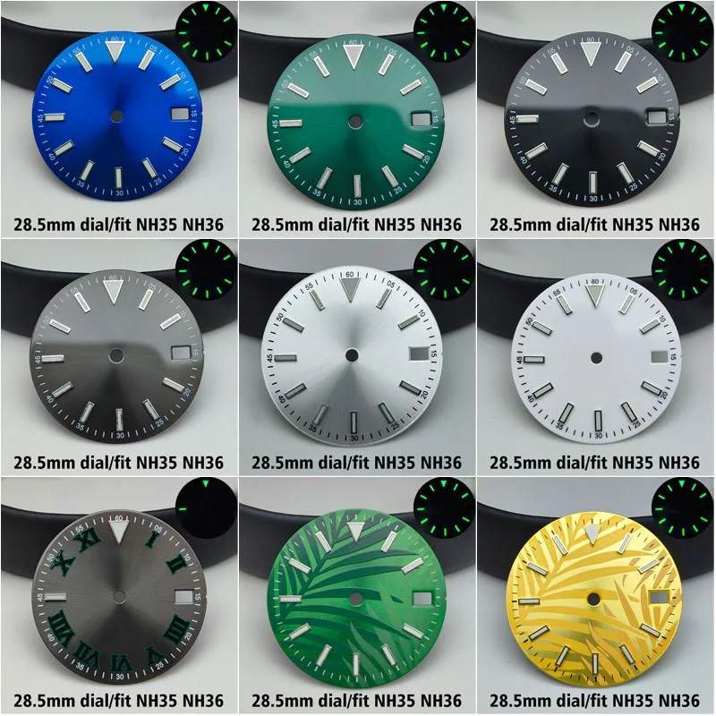

# Miyota 8285 Movement — Specs

### Manufacturer: Miyota (Citizen group)

| Spec | Value |
|------|-------|
| Type | Automatic (self-winding + manual wind + hacking) |
| Size | 11.5 ligne (~25.6mm diameter) |
| Height | ~5.67mm |
| Jewels | 21 |
| Frequency | 21,600 bph |
| Power Reserve | ~42 hours |
| Complications | Day + Date |
| Dial Size | 28.5mm (note: some sources say 31mm) |
| Case Size | 40–42mm, 20mm lug width |

### AliExpress Movement Price
~AU$20–35

### Verdict
Good for day-date complication. Smaller ecosystem than NH35 but solid.
Day-date is a popular dress watch complication.
