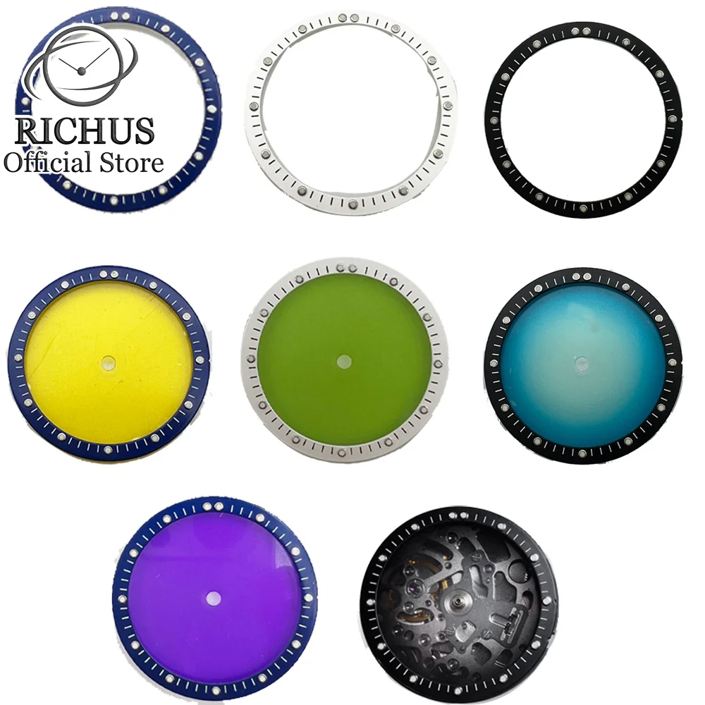

# NH35 Movement — Specs

### Manufacturer: TMI (Seiko group)

| Spec | Value |
|------|-------|
| Type | Automatic (self-winding + manual wind + hacking) |
| Size | 12 ligne (~27.4mm diameter) |
| Height | ~5.32mm |
| Jewels | 24 |
| Frequency | 21,600 bph (3 Hz) |
| Power Reserve | ~41 hours |
| Complications | Date only |
| Dial Size | 28.5mm (universal standard) |
| Case Size | 36–42mm, 20mm lug width |

### AliExpress Movement Options

| Type | Price | Orders | Rating | Notes |
|------|-------|--------|--------|-------|
| Japan Genuine NH35A | AU$79.39 | 10,000+ | 4.9 | Best quality |
| Japan NH35 (white date) | AU$59.52 | 5,000+ | 4.9 | Best value genuine |
| China NH35 | AU$32.87 | 294+ | 4.3 | Budget, lower reliability |

### Verdict
THE modding movement. Biggest parts ecosystem. Use as default for Kosen.

### Also Compatible
NH36 (day-date), NH38 (no date), NH72 (skeleton) — all share same platform, same cases/hands/dials.
