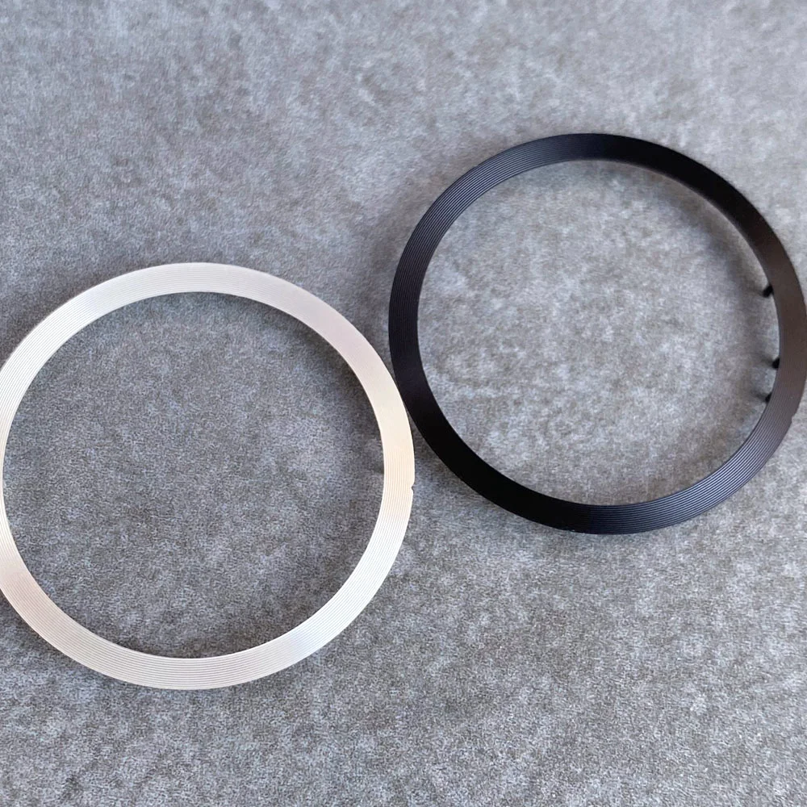

# VK63A Movement — Specs

### Manufacturer: TMI (Seiko group)

| Spec | Value |
|------|-------|
| Type | Quartz mechaquartz (quartz timekeeping + chronograph) |
| Size | 13.5 ligne (~30.4mm diameter) |
| Height | 5.10mm |
| Battery | SR936SW (~3 year life) |
| Complications | Chronograph (centre 1/5 sec + minute counter), 24hr subdial, small seconds, date |
| Dial Size | 31–33mm (larger due to subdials) |
| Case Size | 39.7mm standard (some 42mm), 20mm lug width |

### AliExpress Movement Price
~AU$12–20

### Verdict
✅ Confirmed chronograph. Cheapest movement. Great for sporty/chrono builds.
Best margins of all 4 movements (COGS ~$43–81, sell at $200+).
